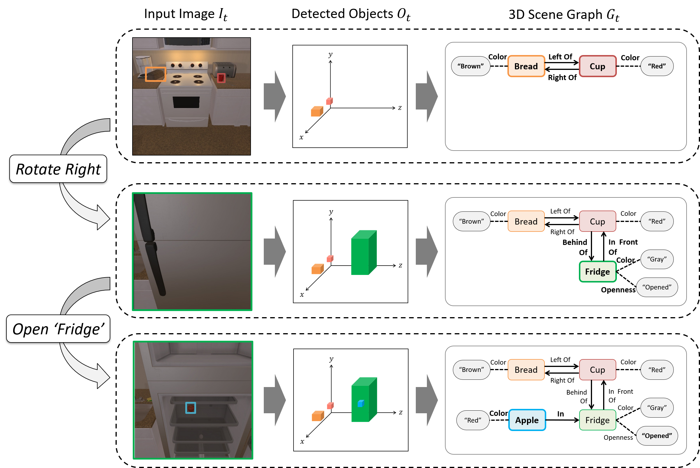
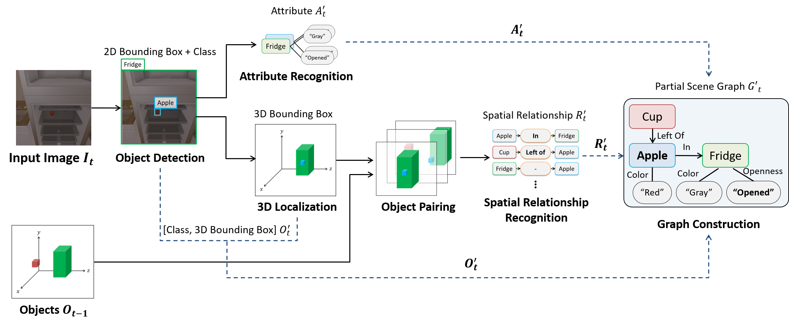
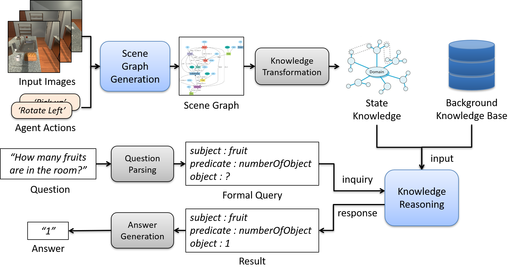

# 3D Scene Graph Generation
- 3D Scene Graph includes Objects, Attributes and Spatial Relationships in 3D virsual environments (Ai2THOR).
    <p></p>
    <p align="left" vlign="center">
      
    </p>

## component
- ARNet_ai2thor : Deep Neural Networks for 3D Scene Graph Generation  
    <p align="left" vlign="center">
      
    </p>
- VeQA : Question Answering System (this need reasoning server with knowrob ontology)  
    <p align="left" vlign="center">
      
    </p>
- PyTorch_YOLOv3 : YOLOv3 repo  

## How to run
```
# install pytorch v0.4.1

pip install -r requirements.txt
python run_thor.py
```


